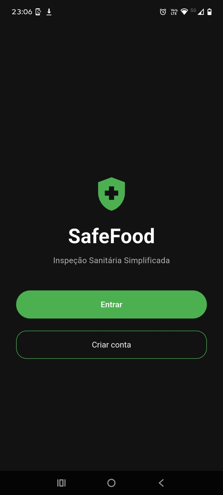
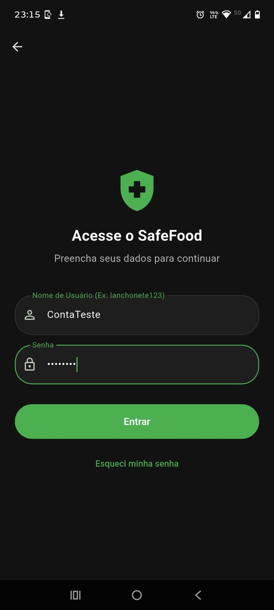
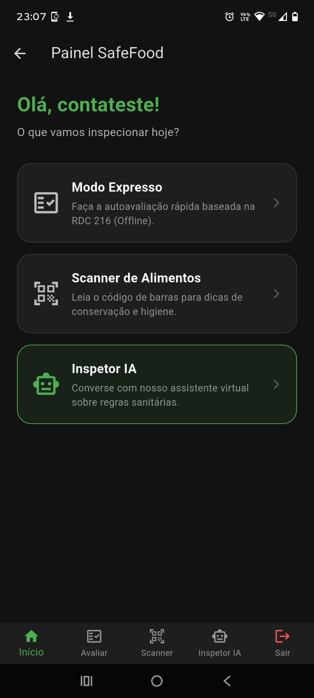
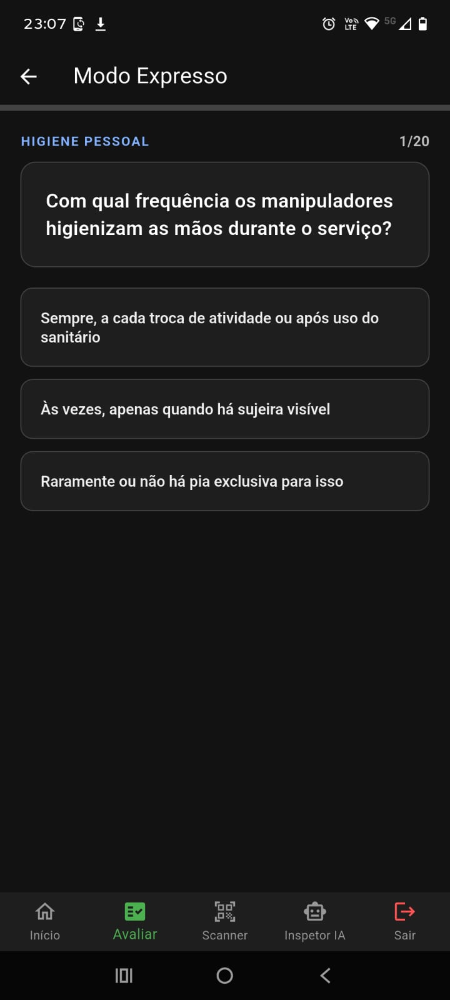
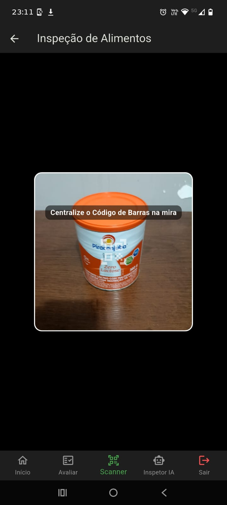
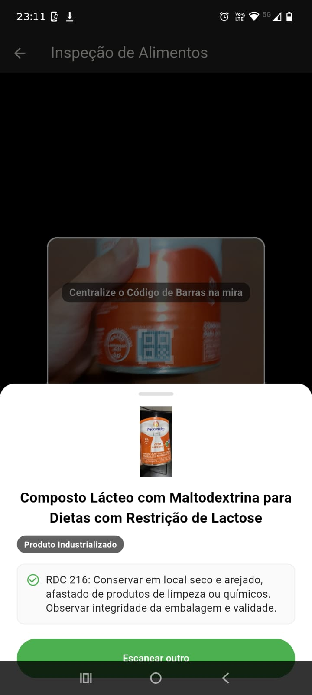
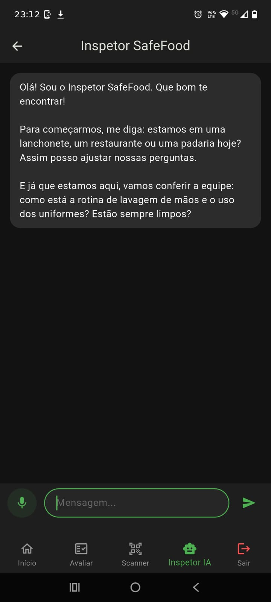
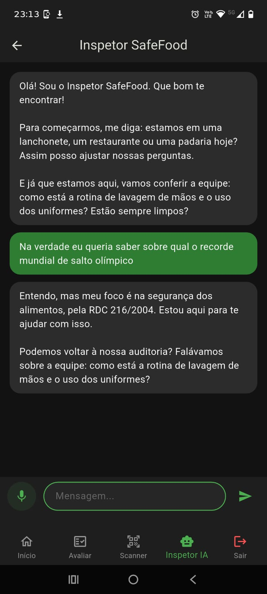
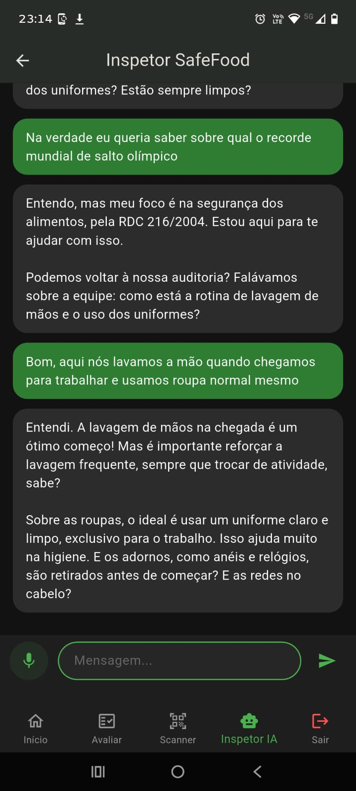

# 🛡️ SafeFood — Documentação Técnica do Protótipo Funcional

Bem-vindo ao repositório de documentação e auditoria visual do **SafeFood**: um protótipo de aplicativo móvel desenvolvido para simplificar a autoavaliação sanitária e a orientação sobre segurança dos alimentos, com base na **RDC nº 216/2004 (ANVISA)**.

> **Nota de Autoria e Confidencialidade:**  
> Este repositório destina-se exclusivamente à demonstração visual, arquitetural e documental da aplicação. O código-fonte integral permanece em repositório privado sob propriedade e autoria de **Gabriel Tupynambá**.

---

## 🚀 Acesse o Protótipo

Teste o SafeFood agora mesmo através do navegador, instale no seu dispositivo Android ou assista ao nosso vídeo de apresentação do projeto:

* 🌐 **Acesso Web (PWA):** [Clique aqui para acessar o SafeFood](https://safefood-app-5c91b.web.app)
* 📱 **Download Android (APK):** [Baixar SafeFood.apk](./SafeFood.apk)
* 🎬 **Vídeo de Apresentação:** *Ainda não disponível — Link em breve*

### 🗝️ Acesso Demonstrativo para Avaliação
Para testes operacionais rápidos na build de demonstração, você pode utilizar as seguintes credenciais sem a necessidade de registro:
* **Usuário:** `ContaTeste`
* **Senha:** `testando`

---

## 📱 Fluxo de Funcionamento e Telas Reais

### 1. Autenticação e Entrada no Sistema
O aplicativo conta com fluxo completo de identificação, permitindo a recepção do usuário, login direto ou criação de conta anônima com nome de usuário e senha da preferência do usuário.

| Tela de Apresentação | Tela de Login | Registro de Conta |
| :---: | :---: | :---: |
|  |  |  |

---

### 2. Painel Central & Checklist Sanitário
Após autenticado, o usuário acessa a tela inicial do SafeFood. O módulo de checklist conduz uma autoavaliação objetiva offline baseada nos 20 pontos de checagem críticos da RDC 216/2004, gerando o resultado da inspeção.

| Painel Principal | Formulário RDC 216 | Resultado do Checklist |
| :---: | :---: | :---: |
|  |  |  |

---

### 3. Leitura de Código de Barras e Orientação Sanitária
Módulo de leitura ótica (EAN-13) pela câmera do dispositivo. Ao escanear um produto comercial, o sistema realiza a busca de informações e apresenta as diretrizes sanitárias de conservação e manuseio.

| Leitura do Código de Barras | Resultado e Orientações do Produto |
| :---: | :---: |
|  |  |

---

### 4. IA Sanitária & Controle de Escopo (Guardrails)
O assistente virtual utiliza o modelo **Google Gemini** pré-configurado com instrução de sistema (*System Prompt*) para auditoria sanitária. 

> 💡 **Demonstração de Segurança (Guardrail):** Se o usuário tenta desviar o assunto com perguntas alheias (ex: *"recorde de salto olímpico"*), a IA recusa a resposta e redireciona a conversa de volta à auditoria sanitária.

| Início da Conversa | Tentativa de Fuga do Escopo | Resposta Orientada à RDC 216 |
| :---: | :---: | :---: |
|  |  |  |

---

## 🛠️ Ficha Técnica e Dependências do Projeto

* **Linguagem & Framework:** Dart / Flutter
* **Backend & Autenticação:** `firebase_core` e `firebase_auth`
* **Processamento de Imagem / Barcode:** `mobile_scanner` (Leitura nativa EAN-13)
* **Motor de IA Conversacional:** `google_generative_ai` (SDK Oficial Gemini)
* **Acessibilidade & Operação por Voz (Hands-Free):** `speech_to_text`, `record`, `flutter_tts` e `audioplayers`
* **Integração de APIs de Rede:** `http` e `path_provider`

---

## 🚀 Próximos Passos do Desenvolvimento (P&D)

- [x] Protótipo funcional e fluxo de navegação completo em Flutter.
- [x] Módulo de leitura ótica de código de barras e filtro conversacional da IA.
- [x] Interface com suporte à acessibilidade hands-free por comandos de voz.
- [ ] **Implementação da Arquitetura RAG (Retrieval-Augmented Generation):** Substituição do filtro determinístico por busca vetorial na legislação sanitária.
- [ ] **Etapa de Alpha Testing:** Validação científica e curadoria do conteúdo gerado com supervisão especialista na RDC nº 216/2004.

---
© 2026 Gabriel Tupynambá. Todos os direitos reservados.
